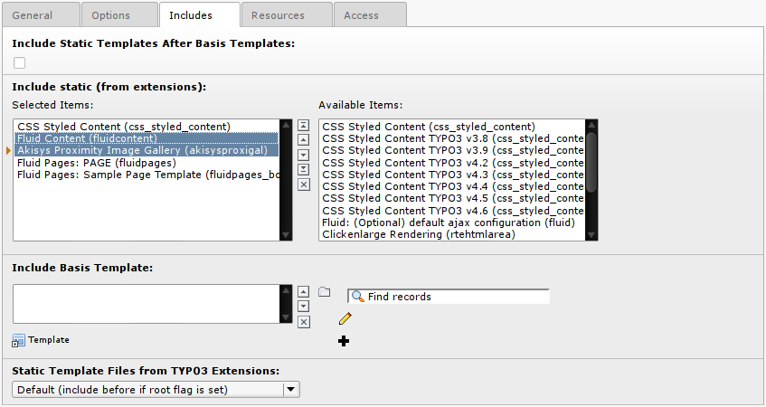

============================
Administrator Manual
============================

This extension comes without special configuration, every setting takes place
in the Content Element.

Installation
=============

Install the extension as normal in the Extension Manager.

The extension has the following dependencies:

* flux
* fluidcontent
* vhs
* t3jquery

Setup the included static templates, in order to use the provided Content
Element. The order of static templates matters, first include the Fluidcontent
Static Template and then the supplied template from this extension, like in
the picture.

		The order of the included static templates.

