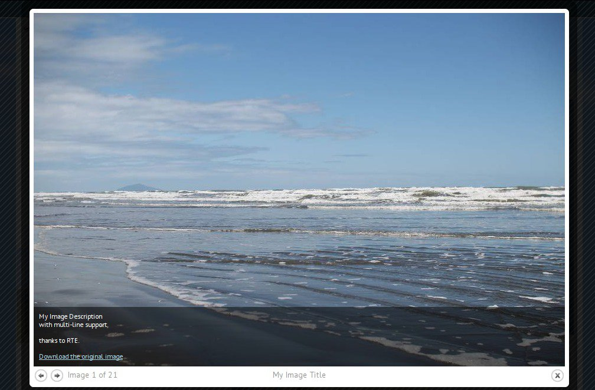

..  Editor configuration
	...................................................
	* utf-8 with BOM as encoding
	* tab indent with 4 characters for code snippet.
	* optional: soft carriage return preferred.

.. Includes roles, substitutions, ...
.. include:: _IncludedDirectives.txt

=================
|extension_name|
=================

:Extension name: |extension_name|
:Extension key: |extension_key|
:Version: 0.1.0
:Description: manuals covering TYPO3 extension "|extension_name|"
:Language: en
:Author: |author|
:Creation: 20-04-2013
:Generation: |time|
:Licence: Open Content License available from `www.opencontent.org/opl.shtml <http://www.opencontent.org/opl.shtml>`_

The content of this document is related to TYPO3, a GNU/GPL CMS/Framework available from `www.typo3.org
<http://www.typo3.org/>`_

**Table of Contents**

.. toctree::
	:maxdepth: 2

	ProjectInformation
	UserManual
	AdministratorManual

What does it do?
=================

This extension generates a grid-based image gallery, where each image stands out
according to the proximity of the users mouse pointer.
The included lightbox (`Colorbox <http://www.jacklmoore.com/colorbox/>`_) 
enables the user to display a larger version of each source image with the
possibility to include a title, a detailed description and a download link of
the source image file.

See the gallery in action.

		The gallery without any interaction visible in the Frontend.

		The gallery with mouse-hover interaction visible in the Frontend.

		The single view of one picture within the included lightbox.

