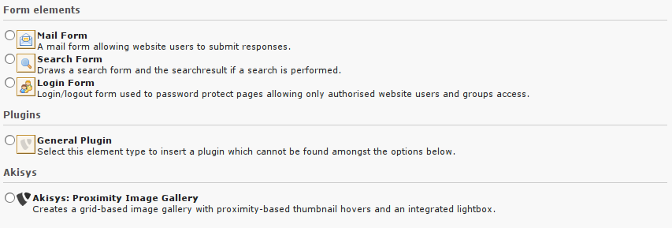
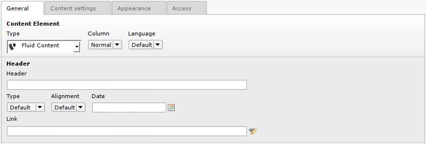
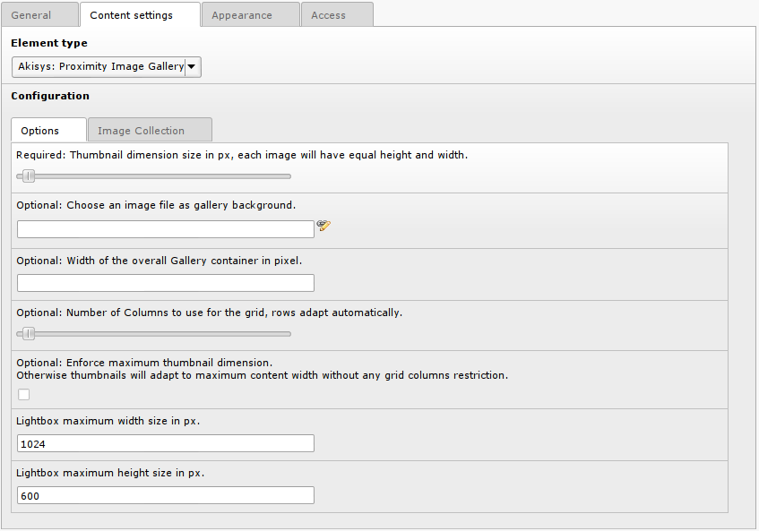
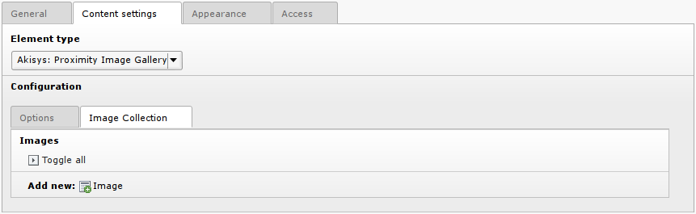
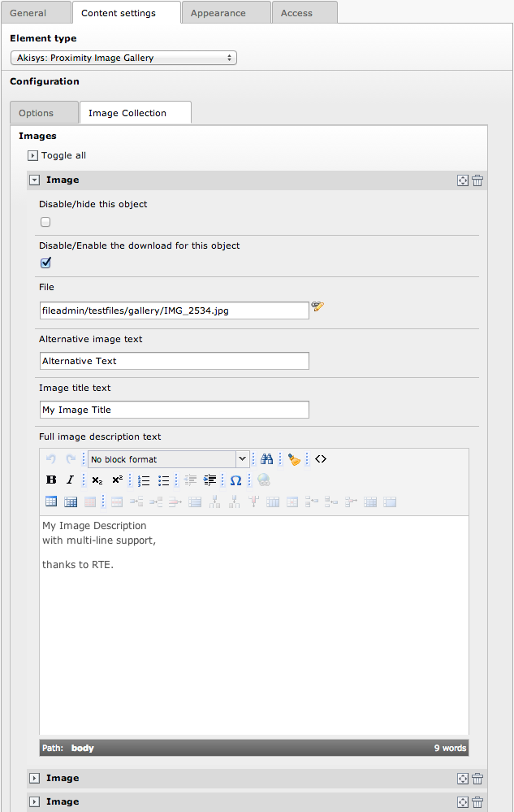

============
Users manual
============

Once everything is set up according to the :doc:`AdministratorManual` every Editor
is able to add the new Content Element to it's page.

* Select the Content Element from your available list

* Setup all general information to your needs

* Change to the Content Settings Tab and you will see all available Options

* Change to the Image Collection Tab and add some images from the fileadmin

* Every time you add a new image, you have the possibility to setup specific options

.. add here:
	@todo: Add something to FAQ according to resposes.
